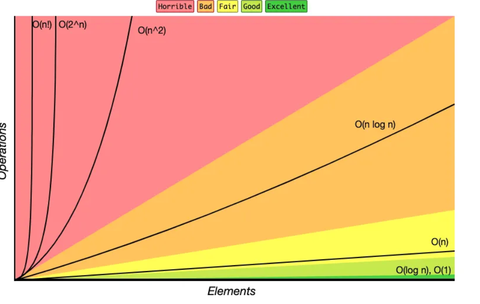

# COMPLEXIDADE ALGORÍTMICA

## Gráfico de complexidade


## Graus de complexidade

Do mais simples e otimizado ao mais complexo e não otimizado

Constante
* O(1)

Logarítimica
* O(log n)

Linear
* O(n)

Linear Logarítmica
* O(n log n)

Quadrática
* O(n^2)

Exponencial
* O(2^n)

Fatorial
* O(n!)


## Descobrindo complexidade

1 - Busque as repetições (laços de repetição) dentro do código

2 - Verifique a complexidade de funções ou métodos da linguagem se estiver utilizando algum

3 - Ignore constantes quando for definir o grau de complexidade

4 - Simplifique e una as complexidades

5 - Utilize o termo de maior grau de complexidade


## Praticando com exemplos

### Complexidade linear

**Exemplo:** 

```cpp
void complexidadeLinear(const std::vector<int>& arr, int valor) {
    int contador = 1;
    for(int x = 0; x < arr.size(); x++) {
        contador++;
        if(arr[x] == valor){
            std::cout << "\nComplexidade linear: ";
            printf("achei o valor %d com %d acessos ao array de %ld posições\n", valor, contador, arr.size());
            return;
        }
    }
}
```
<br />

**Passo 1 - Buscando repetições / iterações**

Considerações:

* Temos apenas um laço de repetição, logo, complexidade O(n)

```cpp

for(int x = 0; x < arr.size(); x++) {
    contador++;
    if(arr[x] == valor){
        std::cout << "\nComplexidade linear: ";
        printf("achei o valor %d com %d acessos ao array de %ld posições\n", valor, contador, arr.size());
        return;
    }
}

```

<br />

**Passo 2 - Buscando funções nativas e suas complexidades**

Considerações:

* Temos apenas std::vector size() de complecidade O(1). Fonte: [std::vector.size()](https://en.cppreference.com/w/cpp/container/vector/size)
* Ocorre duas vezes no exemplo, logo, O(1) + O(1)

```cpp

arr.size()

```

<br />

**Passos 3, 4 e 5 - Calculando complexidade**


O(n) + O(1) + O(1)

O(n) + ~~O(1) + O(1)~~

Complexidade final: **O(n)**